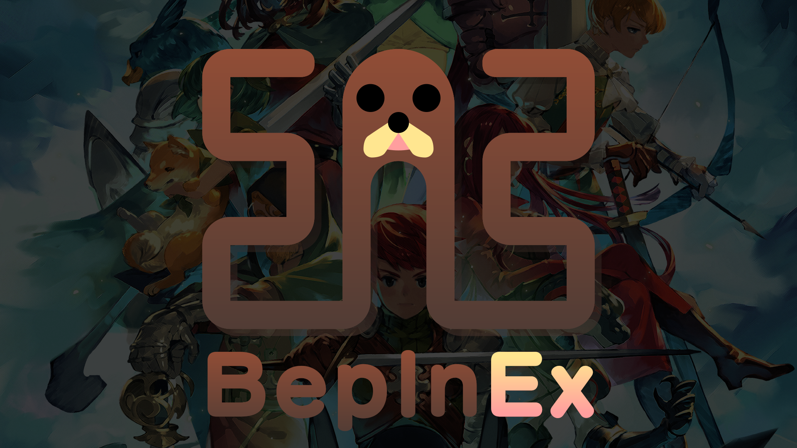

# Tobey's BepInEx Pack for Chained Echoes

> [!IMPORTANT]
> 
> At present, Steam users _must_ switch to the `kickstarteralphabacker` beta branch to use this BepInEx pack!

This is a [BepInEx](https://github.com/BepInEx/BepInEx) pack for Chained Echoes, preconfigured and ready to use on Windows, macOS and Linux (including SteamOS)!

BepInEx is a general purpose framework for Unity modding. BepInEx includes tools and libraries to

-   load custom code (hereafter _plugins_) into the game on launch;
-   patch in-game methods, classes and even entire assemblies without touching original game files;
-   configure plugins and log game to desired outputs like console or file;
-   manage plugin dependencies.

BepInEx is currently [one of the most popular modding tools for Unity on GitHub](https://github.com/topics/modding?o=desc&s=stars).

## This pack's contents

This pack is preconfigured and ready to use for Chained Echoes modding.\
In particular, this pack comes with:

- [Tobey.FileTree](https://github.com/toebeann/Tobey.FileTree), a configurable BepInEx plugin which logs the game's file tree to aid in troubleshooting issues, and
- the `mscorlib.dll` assembly for Unity v2020.3.36 as the one shipped with the game has certain features removed. This enables compatibility with [Unity Explorer](https://github.com/sinai-dev/UnityExplorer)'s REPL functionality, as well as any plugin requiring access to the `System.Reflection.Emit` namespace, among others.

## Easy Automated Installation

> [!IMPORTANT]
> 
> **With just this pack installed, you will not see any changes in-game!**
> 
> Check the `LogOutput.log` file in the `BepInEx` folder to determine whether BepInEx has loaded.

### Windows (Vortex)

[Vortex](https://www.nexusmods.com/about/vortex/) is a tool for installing and managing mods on Windows. It can install all kinds of mods for Chained Echoes and other games, including this pack.

1. Install [Vortex Mod Manager](https://www.nexusmods.com/about/vortex/) and the [Chained Echoes Support](https://www.nexusmods.com/site/mods/519) extension if you haven't already. Make sure they're fully up-to-date.
1. In Vortex, simply begin managing Chained Echoes from the Games tab, and Vortex will automatically install the BepInEx Pack for you.
1. Check the 🔔 notifications area at the top right of Vortex:
    - If you see a notification saying "Elevation needed to deploy," click `Elevate` and authorize the elevation.
    - If you see any other notifications saying "Deployment needed" or similar, click `Deploy`.
1. Run the game.

### macOS (gib)

[gib](https://github.com/toebeann/gib) is a command-line tool which automates installation of BepInEx on macOS, as installing it manually is quite cumbersome and error-prone. gib makes it easy.

1. [Download Tobey's BepInEx Pack for Chained Echoes](https://github.com/toebeann/BepInEx.ChainedEchoes/releases/latest/download/Tobey.s.BepInEx.Pack.for.Chained.Echoes.zip). Make sure to unzip it in your Downloads folder if your browser doesn't do this automatically.
1. Open Terminal with Launchpad or Spotlight (press `⌘ Space`, type `terminal` and press `Enter`).
1. Copy the command from [the Usage section of the gib README](https://github.com/toebeann/gib#usage) and paste it into the Terminal with `⌘ V`, and press `Enter` to run it.

If you get stuck, refer to the [gib README](https://github.com/toebeann/gib#readme) for help.

## Manual Installation

> [!WARNING]
> 
> It is _strongly_ recommended that macOS users [install with gib](#macos-gib), as manual installation on macOS is _extremely_ tedious and error prone!

> [!TIP]
> 
> The game folder is the folder containing the game's executable (e.g. `Chained Echoes.exe`).
> 
> Steam users can find the game folder by right-clicking the game in their Steam library and selecting `Manage` -> `Browse local files`.

To install manually, follow these instructions:

1. [Download Tobey's BepInEx Pack for Chained Echoes](https://github.com/toebeann/BepInEx.ChainedEchoes/releases/latest/download/Tobey.s.BepInEx.Pack.for.Chained.Echoes.zip).
1. Extract the contents of the downloaded archive into the game folder.\
   **ℹ️** _That just means open the .zip file and drag the files and folders out into the game folder!_
3. Depending on your operating system:
    - Windows users: Run the game.
    - Linux & macOS users: Follow the configuration instructions for your operating system below:

> [!IMPORTANT]
> 
> **With just this pack installed, you will not see any changes in-game!**
> 
> Check the `LogOutput.log` file in the `BepInEx` folder to determine whether BepInEx has loaded.

### Configuration on Linux (SteamOS etc.)

1. If you don't own the game on Steam, add it to Steam as a non-Steam game.
1. Make the `run_bepinex.sh` executable with `chmod u+x run_bepinex.sh`
1. In Steam, go to the game's properties and set the launch arguments to:
    ```
    ./run_bepinex.sh %command%
    ```
    It may be necessary to replace `./run_bepinex.sh` with an absolute path to the script in your game folder.
1. Run the game via Steam.

At this moment you may not see any clear indication that BepInEx is working. It is suggested to test by installing a simple plugin such as [ConfigurationManager](https://github.com/BepInEx/BepInEx.ConfigurationManager/releases) and then pressing `F1` to open the Configuration Manager window.

### Configuration on macOS

1. If you don't own the game on Steam, [add it to Steam as a non-Steam game](https://github.com/toebeann/gib/wiki/Adding-non%E2%80%90Steam-games-to-Steam).
1. Make the `run_bepinex.sh` executable in Terminal with `chmod u+x run_bepinex.sh`
1. In Steam, go to the game's properties and set the launch arguments to:
    ```
    "<path to game folder>/run_bepinex.sh" %command%
    ```
    Make sure to replace `<path to game folder>` with the path to the folder where Chained Echoes is installed!
1. Run the game via Steam.
1. At this point, you may see a prompt warning you that `libdoorstop_x64.dylib` cannot be opened because the developer is unverified. In this case:
   1. Open System Preferences.
   1. Go to Security & Privacy and select the General tab.
   1. Towards the bottom you should see a message saying that the program was blocked from opening. Click `Open Anyway` and confirm the prompt that pops up.
   1. Run the game via Steam.

At this moment you will not see any clear indication that BepInEx is working. It is suggested to test by installing a simple plugin such as [Configuration Manager](https://github.com/BepInEx/BepInEx.ConfigurationManager/releases) and then pressing `F1` to open the Configuration Manager window.

## Installing mods

> [!NOTE]
> 
> The paths in this section are relative to the game folder, i.e. `BepInEx/plugins` = `[game folder]/BepInEx/plugins`, where `[game folder]` is the path to the folder containing the game's executable (e.g. `Chained Echoes.exe`).
> 
> Steam users can find the game folder by right-clicking the game in their Steam library and selecting `Manage` -> `Browse local files`.

> [!TIP]
> 
> "Extract the .zip" simply means take the contents of the .zip file and put them in the specified location.
> 
> For example, if you are told to "extract the .zip" or "extract the contents of the archive" into `BepInEx/plugins`, then you can simply open the .zip archive by double-clicking on it, then just select everything inside and drag the contents into your `BepInEx/plugins` folder. Easy!

**It is _strongly_ recommended to read and follow the instructions provided in the description of each mod you download.**

However, sometimes mod authors don't give good (or any) instructions, or you just can't be bothered to read them (we've all been there). For those occasions, here's a simple reference:

### Mod installation by type

| Mod type           | Where to extract the .zip |
| ------------------ | ------------------------- |
| BepInEx plugin     | `BepInEx/plugins`         |
| BepInEx patcher    | `BepInEx/patchers`        |

### Mod installation by .zip structure

| Folder located in root of .zip | Where to extract the .zip   |
| ------------------------------ | ----------------------------|
| `BepInEx`                      | Directly in the game folder |
| `plugins`                      | `BepInEx`                   |
| `patchers`                     | `BepInEx`                   |

### I still can't figure it out!

First, double check and follow the instructions on the mod page. If you still can't figure it out or there aren't any instructions on the mod page, you'll have to get in touch with the author of the mod somehow. Your best bet is usually going to be the Nexus Mods posts tab of that mod. Make sure to check that the question hasn't already been asked and answered.

## Useful links for mod authors

-   [BepInEx: writing basic plugin walkthrough](https://docs.bepinex.dev/articles/dev_guide/plugin_tutorial/)
-   [BepInEx: useful plugins for modding](https://docs.bepinex.dev/articles/dev_guide/dev_tools.html)
-   [BepInEx: patching game methods at runtime](https://docs.bepinex.dev/articles/dev_guide/runtime_patching.html)

## Issues, questions, etc.

First, please make sure to check that the answer you're looking for isn't already somewhere on this page. Use Ctrl+F to search for keywords.

Second, check [the FAQ](https://github.com/toebeann/BepInEx.ChainedEchoes/wiki/FAQ) to see if there is an answer there.

If not, at this moment, you can use the following channels to ask for help:

-   [Nexus Mods posts tab](https://www.nexusmods.com/chainedechoes/mods/2/?tab=posts)
-   [GitHub issues](https://github.com/toebeann/BepInEx.ChainedEchoes/issues)
-   [BepInEx Discord](https://discord.gg/MpFEDAg) -- **Intended for developers, only technical support for BepInEx itself will be provided. No support for mods.**

## Licensing

This GitHub repository contains no code or binaries from external sources, only code used to automatically put together a preconfigured .zip of the BepInEx pack.

However, the .zip created by this repository's code contains binaries from the following projects, redistributed without modification and in accordance with their licenses:

| Project                                                              | License(s)                                                                   |
| ---------------------------------------------------------------------| -----------------------------------------------------------------------------|
| [BepInEx](https://github.com/BepInEx/BepInEx)                        | [LGPL-2.1](https://github.com/BepInEx/BepInEx/blob/master/LICENSE)           |
| [Tobey.FileTree](https://github.com/toebeann/Tobey.FileTree)         | [LGPL-3.0](https://github.com/toebeann/Tobey.FileTree/blob/main/LICENSE)     |

The code in this repository is licensed under the [LGPL-2.1 license](https://github.com/toebeann/BepInEx.SupermarketSimulator/blob/main/LICENSE).
